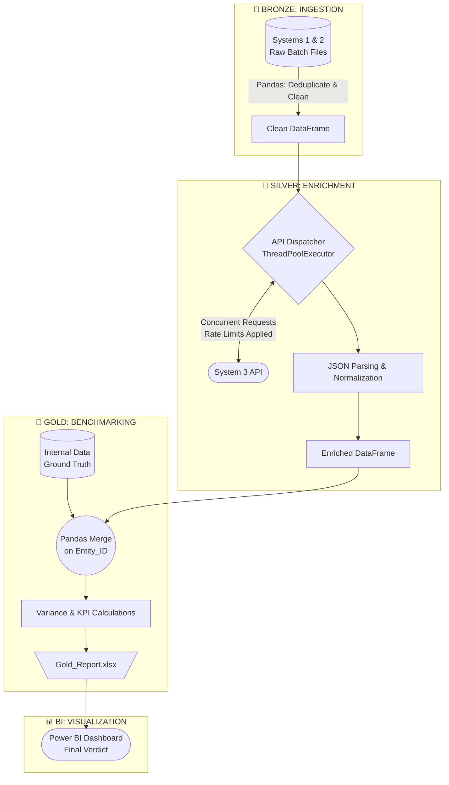

# Vendor Benchmarking Analytics: End-to-End Data Pipeline & BI Dashboard

> ⚠️ **NDA Notice:** This repository contains a fully anonymized version of a production pipeline. All proprietary logic, provider names, and sensitive identifiers have been masked (e.g., mapped to hex-keys) to comply with corporate confidentiality standards.

## Project Overview

This project answers a critical business question: **How do 3 external data providers compare in accuracy, and which redundant contracts can we shut down to cut costs?**

Instead of manual Excel comparisons, I built an automated, full-stack analytical workflow (Medallion Architecture):
* 🥉 **Bronze (Extraction):** Cleaned and standardized historical tracking data from two internal systems using Python (Pandas).
* 🥈 **Silver (API Enrichment):** Built a concurrent Python pipeline to pull missing data from **7 distinct API endpoints**, merging them into a single dataset.
* 🥇 **Gold (Analytics & BI):** Modeled the variance metrics into a **Power BI dashboard** to deliver a clear, executive-ready verdict.

## Real-World Business Impact

* **Cost Optimization:** Provided the exact error-rate metrics management needed to confidently drop two underperforming vendors and save money.
* **Automated Analytics:** Replaced manual data gathering with a programmatic, easily reproducible Python pipeline.
* **Stopping the Guesswork:** Transformed messy logs and JSON responses into clear, data-driven decisions.

## 📊 Data Visualization & BI Layer

To make the final decision obvious, the enriched dataset feeds directly into a custom **Power BI Dashboard**. 


*🔍 [Click here to view or download the full High-Res PDF report](dashboards/images/Data_Provider_Benchmarking.pdf)*

### Key Analytical Metrics
* **Accuracy Benchmarking:** Head-to-head comparison of our internal ground-truth data vs. external vendors.
* **Deviation Severity:** Measuring not just *if* a prediction was wrong, but *how badly* (1-day vs. 5+ days delay).
* **Reliability Decay:** Evaluating how vendor accuracy drops depending on the lead time.

## Architecture & Concurrency

Built to bridge the gap between Data Analysis and Data Engineering, this pipeline handles complex data extraction with speed and reliability.

* **Multi-API Aggregation:** Dynamically routes requests to **7 different API endpoints**.
* **Concurrency:** Uses `ThreadPoolExecutor` to process API calls simultaneously, reducing runtime from hours to minutes.
* **OOP Design:** Implemented a core `BaseAPI` class. All 7 API handlers inherit from it, keeping code DRY (Don't Repeat Yourself) and highly scalable.
* **Fault Tolerance:** Built-in rate limiting and isolated threads ensure single API timeouts never crash the batch.

###  Detailed Data Flow (Medallion Architecture)



##  Technology Stack
Data Analysis & BI: Power BI, DAX, Variance Modeling

Data Preparation: Python, Pandas, Openpyxl

API & Connectivity: Python requests, handling complex JSON responses

Software Engineering: OOP, Multi-threading

---

## 📁 Repository Structure

```text
vendor-benchmarking-pipeline/
│
├── config/                  # Centralized environment & settings
│   └── config.py
├── data/                    # Data Lineage (Fake for NDA)
│   ├── 01_raw/              # Bronze: Input files (Systems 1 & 2)
│   └── 02_processed/        # Gold: Final enriched benchmark reports
├── dashboards/              # Analytics & BI assets
│   ├── Vendor_Benchmark.pbix 
│   └── images/
│       └── dashboard_overview.png
├── src/                     # Core ETL logic & orchestration
│   ├── api/                 # Factory pattern & isolated API handlers
│   │   ├── services/
│   │   │   ├── base_service.py 
│   │   │   └── system_api.py    
│   ├── extraction/          # Pandas-based data loading
│   │   └── excel_reader.py  
│   ├── loading/             # Output generation and formatting
│   │   └── writer.py        
│   ├── orchestration/       # Multi-threaded dispatcher & rate limits
│   │   └── dispatcher.py    
│   └── utils/
│       └── logger.py        # Unified logging engine
├── .env.example             # Secure credential template for local runs
├── .gitignore               # 
├── main.py                  # Pipeline orchestrator & entry point
└── README.md
```

## ⚠️ Execution Note & NDA Compliance

Due to strict enterprise Non-Disclosure Agreements (NDA), all proprietary datasets, internal ground-truth files, and live API keys have been entirely removed or anonymized. Therefore, **this pipeline cannot be executed locally**. 


